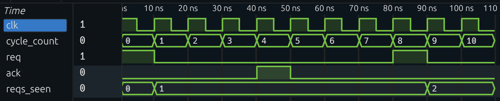

Multi-Stage Verification
========================

This article presents a method for performing *multi-stage* formal verification on hardware designs using Yosys. In multi-stage verification, the verification process is divided into distinct phases, each with its own goals and properties to be verified. The design state at the end of one phase serves as the starting point for the next phase. Key to the method is the use of Yosys's ``sim`` pass to replay simulation traces and set up specific design states before proceeding with further formal verification.

Note that some forms of multi-stage verification are already supported by existing tools such as `SCY <https://github.com/YosysHQ/scy>`_ (Sequence of Covers with Yosys). As the name implies, SCY currently only supports sequences of cover statements. This article describes the general approach that underlies SCY, which can be used to manually implement more complex multi-stage verification flows than what SCY currently supports.

At the highest level, each stage of multi-stage verification works as follows. Assuming we have a simulation trace from the previous stage that reaches the desired initial state, we first replay the trace into the design using Yosys's ``sim`` command with the ``-r`` option, which updates the design state to reflect the end of the trace. Then, we disable all assertions/assumptions/coverpoints/properties not relevant to this stage. Finally, we can then run formal verification from the updated design state using the enabled properties.

Note that this approach comes with significant caveats and limitations. Please read the Caveats section below before attempting to apply this method to your own designs.

What follows is a concrete example illustrating this approach.

Example Design Under Test
-------------------------

Our example design is as follows:

.. code-block:: systemverilog

        module DUT (
                input  logic clk,
                output logic req,
                output logic ack
        );

        `ifdef FORMAL

                logic [1:0] reqs_seen;
                logic [1:0] acks_seen;
                logic [31:0] cycle_count;

                // Deterministic initial state
                initial begin
                        reqs_seen = 2'b0;
                        acks_seen = 2'b0;
                        cycle_count = 32'b0;
                end

                always @ (posedge clk) begin
                        if (req) reqs_seen <= reqs_seen + 1;
                        if (ack && !$past(ack)) acks_seen <= acks_seen + 1;
                        cycle_count <= cycle_count + 1;
                end

                // Req is only high for one cycle
                assume property (@(posedge clk)
                        req |-> ##1 !req
                );

                // Reqs are at least 8 cycles apart
                assume property (@(posedge clk)
                        req |-> ##1 (!req [*7])
                );

                // ack comes exactly 4 cycles after req
                assume property (@(posedge clk)
                        req |-> ##4 ack
                );

                // ack must remain low if no req 4 cycles ago
                assume property (@(posedge clk)
                        !$past(req,4) |-> !ack
                );

                // For the purpose of demonstration, stop exactly when second req pulse
                // occurs. This leaves us in a state where we're waiting for the second ack.
                always @(posedge clk) begin
                        phase1_reqs_seen: cover(reqs_seen == 2);
                end

                // In phase 2, assume that there's no more reqs; then assert the second
                // ack arrives promptly and that ack count never exceeds two.
                always @ (posedge clk) begin
                        phase2_no_new_req: assume(!req);
                end
                phase2_assert_ack_reaches_two: assert property (@(posedge clk)
                        $rose(reqs_seen == 2) |-> ##[1:8] acks_seen == 2
                );
                always @(posedge clk) begin
                        phase2_assert_ack_stable: assert(acks_seen <= 2);
                end

        `endif

        endmodule

The design has two outputs, ``req`` and ``ack``, representing a simple request-acknowledgment protocol. The design's behavior is defined using formal properties in a ``FORMAL`` block, including counters that track how many req/ack pulses have occurred. Note that in a real design, the ``req`` and ``ack`` signals would typically be driven by internal logic; here, we define their behavior via formal properties to keep the example concise.

In staged verification, we use a single testbench which includes all desired verification properties. Later in the process, we will disable properties on a stage-by-stage basis. However, to ensure signals can be matched properly in each stage, it is crucial to always start from the same original testbench including all properties.

Properties for each stage are given ``phase1_*`` and ``phase2_*`` labels. These labels allow us to selectively include or exclude properties during different verification stages using Yosys's ``select`` command.

Example Verification Goal
-------------------------

In this example, we have a simple, two-step verification goal.

1. In the first stage, we want to reach a cover point in which one req-ack pair has occurred, and another req has been issued but not yet acknowledged, leaving the design in a state where it is waiting for the second ack.
2. In the second stage, starting from the state reached in stage 1 and assuming no more requests come in, we want to prove that the second ack arrives within a bounded window and that no additional acks occur beyond the two already seen.

While this example seems contrived, it illustrates the important point: using this approach, the design state at the end of stage 1 can be fully reproduced at the start of stage 2, thus allowing the formal tools to "see" that we are waiting for the second ack. This demonstrates that the underlying formal verification machinery persists its state across each stage.

Furthermore, this simple example goes beyond the capabilities of SCY, which currently only supports sequences of cover statements. Here, stage 2 involves an assertion rather than a cover, showcasing the flexibility of the manual approach.

Implementation
--------------

We can implement the desired flow using a single ``staged.sby`` file that covers in stage 1 and asserts in stage 2:

.. code-block:: text

  [tasks]
  stage_1_init init
  stage_1_cover cover
  stage_2_init init
  stage_2_assert assert

  [options]
  init:
  mode prep

  cover:
  mode cover
  depth 40
  skip_prep on

  assert:
  mode prove
  depth 40
  skip_prep on

  --

  [engines]
  init: none
  cover: smtbmc
  assert: smtbmc

  [script]
  stage_1_init:
  verific -formal Req_Ack.sv
  hierarchy -top DUT
  prep

  stage_1_cover:
  read_rtlil design_prep.il
  # This selection computes (all phase-labeled things) - (all phase-1-labeled
  # things) to remove all phase-tagged SVA constructs not intended for phase 1.
  select */c:phase* */c:phase1_* %d
  delete

  stage_2_init:
  read_rtlil design_prep.il
  sim -a -w -scope DUT -r trace0.yw

  stage_2_assert:
  read_rtlil design_prep.il
  # This selection computes (all phase-labeled things) - (all phase-2-labeled
  # things) to remove all phase-tagged SVA constructs not intended for phase 2.
  select */c:phase* */c:phase2_* %d
  delete

  --

  [files]

  stage_1_init:
  Req_Ack.sv

  stage_1_cover:
  staged_stage_1_init/model/design_prep.il

  stage_2_init:
  staged_stage_1_init/model/design_prep.il
  staged_stage_1_cover/engine_0/trace0.yw

  stage_2_assert:
  staged_stage_2_init/model/design_prep.il

The file defines four tasks. We will now walk through each of them in turn.

Each stage is implemented as two tasks: an ``init`` task that prepares the design state (e.g. via simulation), and a verification task that enables only the relevant properties and performs formal verification from that state. Only the first task runs ``prep``; later tasks set ``skip_prep on`` to reuse the baked IL.

In ``stage_1_init``, we prep the design using sby's default flow using ``mode prep``. This produces the ``design_prep.il`` IL file which serves as the starting point for the first formal verification stage. As this is the initial state, we do not simulate. Note that ``engine`` is set to ``none``, indicating that no formal checking is performed in this task.

In ``stage_1_cover``, we read in the prepared IL, remove all properties not associated with phase 1 using ``select`` and ``delete`` (by filtering on the ``phase1_*`` labels), and run the ``smtbmc`` engine to attempt to cover the phase 1 cover point. 

When ``stage_1_cover`` completes and the cover point is hit, ``smtbmc`` produces a witness file, ``staged_stage_1_cover/engine_0/trace0.yw``, which contains the input sequence and internal signal values that led to the cover point being hit. The trace will look something like this:

As you can see, the first req and ack pair occurs, followed by the second req pulse, at which point the trace ends.

``stage_2_init`` is where we replay the witness generated in stage 1 to set up the design state for stage 2. We read in the original prepared IL from stage 1, and use the ``sim`` command with the ``-r`` option to replay the witness file. The ``-w`` option ensures that the final state of the design (i.e., register and memory values) after replaying the witness is written back into the RTLIL. Note that it is important to use the Yosys Witness output with ``sim -r`` (instead of, e.g., VCD), as it is the highest fidelity and best suited for replay in Yosys simulation. The resulting state-updated IL is written as ``design_prep.il`` under the ``stage_2_init`` directory.

Finally, in ``stage_2_assert``, we perform formal verification for stage 2. We read in the IL produced by ``stage_2_init``, remove all properties not associated with phase 2, and run ``smtbmc`` in ``prove`` mode to show that the second ack arrives within the required window and that ack count never exceeds two.

Caveats
-------

Note that this approach is fragile.
To effectively use this method, first understand the caveats:

- **Only remove properties between stages.** The RTLIL must remain the same aside from baked init values. Do not add or alter HDL, ports, or clocks between stages, or the witness mapping will fail.
- **Keep environment signals free.** Anything mentioned in an ``assume`` that the environment controls must be an ``input`` or ``anyseq``; ``sim`` cannot drive outputs.
- **Witness format.** Stick to ``.yw`` (Yosys witness). VCD is lossy and can miss anyseq/internal names; YW carries the exact solver-driven signals.
- **No retroactive assumptions.** Assumptions from later stages cannot constrain earlier timesteps. If you need multi-cycle assumptions spanning the stage boundary, extend the witness a few cycles before shortening it, or rewrite them to be combinational in terms of free inputs.

A Similar Example Using SCY
-----------------------------

As mentioned earlier, SCY can also be used to implement multi-stage verification flows, albeit with some limitations. SCY currently only supports sequences of cover statements. We modify the example above to include only cover statements in stage 2, removing the assertions:

.. code-block:: systemverilog

        module DUT (
                input  logic clk,
                output logic req,
                output logic ack
        );

        `ifdef FORMAL

                logic [1:0] reqs_seen;
                logic [31:0] cycle_count;

                initial begin
                        reqs_seen = 2'b0;
                        cycle_count = 32'b0;
                end

                always @ (posedge clk) begin
                        if (req) reqs_seen <= reqs_seen + 1;
                        cycle_count <= cycle_count + 1;
                end

                assume property (@(posedge clk)
                        req |-> ##1 !req
                );
                assume property (@(posedge clk)
                        req |-> ##1 (!req [*7])
                );
                assume property (@(posedge clk)
                        req |-> ##4 ack
                );
                assume property (@(posedge clk)
                        !$past(req,4) |-> !ack
                );

                always @(posedge clk) begin
                        cover_phase1: cover(reqs_seen == 2);
                end

                always @ (posedge clk) begin
                        cover_phase2_no_new_req: assume(!req);
                end
                always @(posedge clk) begin
                        cover_phase2: cover(ack);
                end

        `endif

        endmodule

This simpler example simply states that the second ack should eventually arrive after the second req.

With that cover-only DUT, SCY can encode the sequence using the following .scy file:

.. code-block:: text

  [options]
  mode cover
  depth 40

  [engines]
  smtbmc yices

  [design]
  verific -formal Req_Ack.sv
  prep -top DUT

  [files]
  Req_Ack.sv

  [sequence]
  # Disable the phase-2 assume during the first cover, then re-enable it.
  disable cover_phase2_no_new_req
  # 1) Reach the state after the second req pulse.
  cover cover_phase1:
      enable cover_phase2_no_new_req
      # 2) Continue from that state to see the matching ack.
      cover cover_phase2

Using SCY simplifies the process of multi-stage verification by automating the witness replay and property management between stages, and allows the user to avoid potential pitfalls. However, the manual approach described earlier provides more flexibility for complex scenarios (such as the assertion branch in stage 2) that may not be directly supported by SCY.
