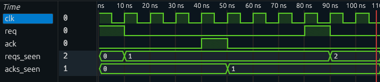
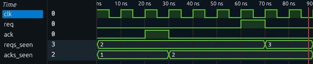
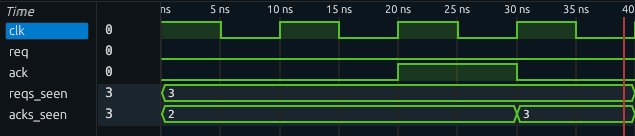

Multi-Stage Verification
========================

This article presents a method for performing *multi-stage* formal verification on hardware designs using Yosys. In multi-stage verification, the verification process is divided into distinct phases, each with its own goals and properties to be verified. The design state at the end of one phase serves as the starting point for the next phase. Key to the method is the use of Yosys's ``sim`` pass to replay simulation traces and set up specific design states before proceeding with further formal verification.

Note that some forms of multi-stage verification are already supported by existing tools such as `SCY <https://github.com/YosysHQ/scy>`_ (Sequence of Covers with Yosys). As the name implies, SCY currently only supports sequences of cover statements. This article describes the general approach that underlies SCY, which can be used to manually implement more complex multi-stage verification flows than what SCY currently supports.

At the highest level, each stage of multi-stage verification works as follows. Assuming we have a simulation trace from the previous stage that reaches the desired initial state, we first replay the trace into the design using Yosys's ``sim`` command with the ``-r`` and ``-w`` options, which replay inputs from a trace file and update the design state to reflect the end of the trace, respectively. Then, we disable all assertions/assumptions/coverpoints/properties not relevant to this stage. Finally, we can then run formal verification from the updated design state using the enabled properties. The trace returned by formal verification can then be used to set up the next stage, and so on.

Note that this approach comes with significant caveats and limitations. Please read the Caveats section below before attempting to apply this method to your own designs.

What follows is a concrete example illustrating this approach.

Example Design Under Test
-------------------------

Our example design is as follows:

.. code-block:: systemverilog

        module DUT (
                input  logic clk,
                output logic req,
                output logic ack
        );

        `ifdef FORMAL

                logic [31:0] reqs_seen;
                logic [31:0] acks_seen;
                logic [31:0] cycle_count;

                // Deterministic initial state
                initial begin
                        reqs_seen = 32'b0;
                        acks_seen = 32'b0;
                        cycle_count = 32'b0;
                end

                always @ (posedge clk) begin
                        if (req) reqs_seen <= reqs_seen + 1;
                        if (ack && !$past(ack)) acks_seen <= acks_seen + 1;
                        cycle_count <= cycle_count + 1;
                end

                // Req is only high for one cycle
                assume property (@(posedge clk)
                        req |-> ##1 !req
                );

                // Reqs are at least 8 cycles apart
                assume property (@(posedge clk)
                        req |-> ##1 (!req [*7])
                );

                // ack comes exactly 4 cycles after req
                assume property (@(posedge clk)
                        req |-> ##4 ack
                );

                // ack must remain low if no req 4 cycles ago
                assume property (@(posedge clk)
                        !$past(req,4) |-> !ack
                );

                // For the purpose of demonstration, stop exactly when second req pulse
                // occurs. This leaves us in a state where we're waiting for the second ack.
                always @(posedge clk) begin
                        stage1_reqs_seen: cover(reqs_seen == 2);
                end

                // In stage 2, cover that the first ack arrives within a bounded window
                // after the first req + another req arrives.
                stage2_cover_ack_and_new_req: cover property (@(posedge clk)
                        $rose(ack) ##[1:$] (reqs_seen == 3)
                );

                // In stage 3, assume that there's no more reqs.
                always @ (posedge clk) begin
                        stage3_shared_no_new_req: assume(!req);
                end

                // In stage 3a, cover the second ack arriving eventually.
                always @(posedge clk) begin
                        stage3a_cover_ack: cover(ack);
                end

                // In stage 3b, assert that once we've seen 3 acks, we stay at 3 acks.
                stage3b_acks_remains_3: assert property (
                        @(posedge clk) $rose(acks_seen == 3) |-> (acks_seen == 3)[*1:$]
                );

        `endif

        endmodule

Note that our design is written with Verific-based parsing in mind, which supports a wider range of SVA constructs. However, the example could be adapted to use Yosys's built-in SystemVerilog parser or yosys-slang.

The design has two outputs, ``req`` and ``ack``, representing a simple request-acknowledgment protocol. The design's behavior is defined using formal properties in a ``FORMAL`` block, including counters that track how many req/ack pulses have occurred. Note that in a real design, the ``req`` and ``ack`` signals would typically be driven by internal logic; here, we define their behavior via formal properties to keep the example concise.

In staged verification, we use a single testbench which includes all desired verification properties. Later in the process, we will disable properties on a stage-by-stage basis. However, to ensure signals can be matched properly in each stage, it is crucial to always start from the same original testbench including all properties.

Properties for each stage are given ``stage1_*``, ``stage2_*``, ``stage3_shared_*``, ``stage3a_*``, and ``stage3b_*`` labels. These labels allow us to selectively include or exclude properties during different verification stages using Yosys's ``select`` command.

Example Verification Goal
-------------------------

In this example, we have a simple, three-stage verification goal.

1. In the first stage, we want to reach a cover point in which one req-ack pair has occurred, and a second req has been issued but not yet acknowledged.
2. In the second stage, starting from the state reached in stage 1, we cover the second ack arriving, followed by a third req arriving.
3. In the third stage, starting from the state reached in stage 2 and assuming no more requests come in, we branch into two separate formal verification tasks: in one task, we cover the third ack arriving, and in the other, we assert that the ack count stays at three once it reaches that value.

While this example seems contrived, it illustrates the important point: using this approach, the design state at the end of stage 1 can be fully reproduced at the start of stage 2 (and similarly for stage 3), allowing the formal tools to "see" the current state and its pending acks. This demonstrates that the underlying formal verification machinery persists its state across each stage.

Furthermore, this simple example goes beyond the capabilities of SCY, which currently only supports sequences of cover statements. Here, stage 3b involves an assertion rather than a cover, showcasing the flexibility of the manual approach.

Implementation
--------------

We can implement the desired flow using a single ``staged.sby`` file that covers in stages 1 and 2, then splits into a cover and an assertion branch in stage 3:

.. code-block:: text

  [tasks]
  prep
  stage_1 cover
  stage_2 cover
  stage_3_init
  stage_3a_cover cover
  stage_3b_assert

  [options]
  prep:
  mode prep

  cover:
  mode cover
  skip_prep on

  stage_3_init:
  mode prep
  skip_prep on

  stage_3b_assert:
  mode prove
  skip_prep on

  --

  [engines]
  prep:
  none

  cover:
  smtbmc

  stage_3_init:
  none

  stage_3b_assert:
  smtbmc

  --

  [script]
  prep:
  verific -formal Req_Ack.sv
  hierarchy -top DUT
  prep

  stage_1:
  read_rtlil design_prep.il
  write_rtlil stage_1_init.il
  # This selection computes (all stage-labeled things) - (all stage-1-labeled
  # things) to remove all stage-tagged SVA constructs not intended for stage 1.
  select */c:stage* */c:stage1* %d
  delete

  stage_2:
  read_rtlil stage_1_init.il
  sim -a -w -scope DUT -r trace0.yw
  write_rtlil stage_2_init.il
  select */c:stage* */c:stage2* %d
  delete

  stage_3_init:
  read_rtlil stage_2_init.il
  sim -a -w -scope DUT -r trace0.yw -noinitstate
  write_rtlil stage_3_init.il

  stage_3a_cover:
  read_rtlil stage_3_init.il
  select */c:stage* */c:stage3_shared* */c:stage3a* %u %d
  delete

  stage_3b_assert:
  read_rtlil stage_3_init.il
  select */c:stage* */c:stage3_shared* */c:stage3b* %u %d
  delete

  --

  [files]

  prep:
  Req_Ack.sv

  stage_1:
  staged_prep/model/design_prep.il

  stage_2:
  staged_stage_1/src/stage_1_init.il
  staged_stage_1/engine_0/trace0.yw

  stage_3_init:
  staged_stage_2/src/stage_2_init.il
  staged_stage_2/engine_0/trace0.yw

  stage_3a_cover:
  staged_stage_3_init/src/stage_3_init.il

  stage_3b_assert:
  staged_stage_3_init/src/stage_3_init.il

The file defines multiple tasks. To actually run the flow, invoke each task one-by-one in order so that each stage's artifacts are available before the next stage starts. For example:

.. code-block:: text

  sby -f staged.sby prep
  sby -f staged.sby stage_1
  sby -f staged.sby stage_2
  sby -f staged.sby stage_3_init
  sby -f staged.sby stage_3a_cover
  sby -f staged.sby stage_3b_assert

.. warning::
        By default, SBY tries to run multiple tasks in parallel. That can make this staged flow flaky, because later stages may start before earlier stages have produced their ``.il`` or ``.yw`` outputs. Always manually run the tasks sequentially to avoid race conditions.

We will now walk through each task in turn.

The flow starts with a dedicated ``prep`` task that runs SBY's full preparation step and generates the canonical ``design_prep.il``. Note that the ``prep`` pass run inside the ``[script]`` section is only the Yosys synthesis pass, and does not replace SBY's internal preparation pipeline, which runs after the user-provided script completes.

.. warning::
        It is crucial that your first stage starts from a version of the design which has been prepared using SBY's preparation step, but hasn't had other modifications applied (e.g. deleting stage-specific properties). Having a separate ``prep`` stage is a clean way to ensure this.

.. warning::
        This flow relies on files generated by SBY (for example, ``design_prep.il``
        and the per-stage ``engine_0/trace0.yw`` outputs). These file and directory
        names are SBY implementation details and may change in future versions.
        If they do, update the ``[files]`` mappings and any paths in the scripts
        accordingly.

In stage 1, we read in the design prepared by the ``prep`` stage and checkpoint it as ``stage_1_init.il``. Note that ``stage_1_init.il`` is identical to ``design_prep.il`` at this point; we follow this pattern for consistency across stages. Note that all stages after ``prep`` have ``skip_prep on`` set in their ``[options]`` section, which tells SBY not to re-run the preparation step. The only thing changing between each ``stage_N_init.il`` is the baked-in design state after replaying the prior stage's trace.

.. warning::
        All stages besides your ``prep`` stage should be marked with ``skip_prep on`` to avoid re-running the preparation step.

After loading the design, we use the ``select`` command to disable all properties except those relevant to stage 1. The selection expression ``*/c:stage* */c:stage1* %d`` matches all properties with a ``stage*`` label and subtracts all properties with a ``stage1*`` label. Deleting this selection removes all properties not intended for stage 1.

After the user-provided script in the ``[script]`` section runs, SBY invokes the specified engine (``smtbmc``) to run formal verification on the filtered design. ``smtbmc`` produces a witness file, ``staged_stage_1/engine_0/trace0.yw``, which contains the sequence of values that led to the cover point being hit. The trace will look something like this:

As you can see, the first req and ack pair occurs, followed by the second req pulse, at which point the trace ends.

Stage 2 begins by reading in the ``stage_1_init.il`` checkpoint, which represents the design state at the start of stage 1, before the stage 1 trace is replayed. We use the ``sim`` command with ``-r`` and ``-w`` to replay the witness file and bake the final state into the RTLIL. We then checkpoint this updated design state as ``stage_2_init.il``, representing the design state at the end of stage 1 and beginning of stage 2.

.. tip::
        The ``sim`` command is essential to this approach, as it allows us to accurately reproduce the design state reached in the previous stage.

Stage 2 then proceeds as did stage 1: we delete all non-stage-2 properties and run the stage-2 cover, producing the following trace:

Crucially, you can see that the trace continues from where stage 1 left off, with the second req already issued and waiting for its ack, and with the counter values preserved.

Finally, in stage 3, we show a branching point with two separate tasks: first, a coverpoint, and second, an assertion. To handle this forking structure, we introduce an intermediate ``stage_3_init`` task that replays the stage-2 witness to set up the design state for both branches. Unlike the first replay, this simulation is technically not starting at t=0, and thus we include ``-noinitstate`` to indicate to the ``sim`` routine that any ``$initstate`` cells (which are active only at t=0) should be disabled. The updated design state is written as ``stage_3_init.il``.

.. warning::
        When continuing a simulation which begins at time greater than 0, always use ``-noinitstate`` to avoid re-applying any ``$initstate`` logic. In general, this will be every usage of ``sim`` after the first. In this tutorial, we do not use it in stage 2, but we do in stage 3, and would in any further stages.

Finally, ``stage_3a_cover`` and ``stage_3b_assert`` both read the stage-3 checkpoint, filter down to their respective property sets (both including the stage-3 shared assumptions), and run cover/prove as appropriate. Stage 3a produces the following trace:

As you can see, the trace continues from where stage 2 left off, with the third req already issued; within a few cycles, the third ack arrives, hitting the cover point.

Caveats
-------

Note that this approach is fragile.
To effectively use this method, first understand the caveats:

- **Only remove properties between stages.** The RTLIL must remain the same aside from baked init values. Do not add or alter HDL, ports, or clocks between stages, or the witness mapping will fail.
- **Keep environment signals free.** Anything mentioned in an ``assume`` that the environment controls must be an ``input`` or ``anyseq``; ``sim`` cannot drive outputs.
- **Witness format.** Stick to ``.yw`` (Yosys witness). VCD is lossy and can miss anyseq/internal names; YW carries the exact solver-driven signals.
- **Initial-state handling.** Only the first replay starts at t=0. For any replay that continues from a prior witness, use ``sim -noinitstate`` to avoid re-applying ``$initstate`` logic.
- **SBY-generated artifacts.** This flow depends on SBY-emitted files (for example, ``design_prep.il`` and per-stage ``engine_0/trace0.yw``). These names are implementation details and may change across SBY versions, requiring updates to ``[files]`` mappings and scripts.
- **Sequential execution.** Run tasks one-by-one. SBY defaults to parallel task execution, which leads to race conditions on the intermediate ``.il``/``.yw`` artifacts. Always run tasks manually to ensure proper sequential execution.
- **Skipping prep.** Only the first task should run SBY's full prep. All later tasks should set ``skip_prep on``.

A Similar Example Using SCY
-----------------------------

As mentioned earlier, SCY can also be used to implement multi-stage verification flows, albeit with some limitations. SCY currently only supports sequences of cover statements. We modify the example above to include only cover statements through stage 3a, removing the stage-3b assertion:

.. code-block:: systemverilog

        module DUT (
                input  logic clk,
                output logic req,
                output logic ack
        );

        `ifdef FORMAL

                logic [31:0] reqs_seen;
                logic [31:0] acks_seen;
                logic [31:0] cycle_count;

                initial begin
                        reqs_seen = 32'b0;
                        acks_seen = 32'b0;
                        cycle_count = 32'b0;
                end

                always @ (posedge clk) begin
                        if (req) reqs_seen <= reqs_seen + 1;
                        if (ack && !$past(ack)) acks_seen <= acks_seen + 1;
                        cycle_count <= cycle_count + 1;
                end

                assume property (@(posedge clk)
                        req |-> ##1 !req
                );
                assume property (@(posedge clk)
                        req |-> ##1 (!req [*7])
                );
                assume property (@(posedge clk)
                        req |-> ##4 ack
                );
                assume property (@(posedge clk)
                        !$past(req,4) |-> !ack
                );

                always @(posedge clk) begin
                        stage1_reqs_seen: cover(reqs_seen == 2);
                end

                stage2_cover_ack_and_new_req: cover property (@(posedge clk)
                        $rose(ack) ##[1:$] (reqs_seen == 3)
                );

                always @ (posedge clk) begin
                        stage3_shared_no_new_req: assume(!req);
                end
                always @(posedge clk) begin
                        stage3a_cover_ack: cover(ack);
                end

        `endif

        endmodule

This simpler example follows the same three-stage cover sequence, but omits the stage-3b assertion.

With that cover-only DUT, SCY can encode the sequence using the following .scy file:

.. code-block:: text

  [options]
  mode cover
  depth 40

  [engines]
  smtbmc yices

  [design]
  verific -formal Req_Ack.sv
  prep -top DUT

  [files]
  Req_Ack.sv

  [sequence]
  # 1) Reach the state after the second req pulse.
  cover stage1_reqs_seen:
      # 2) Continue from that state to see an ack and another req.
      cover stage2_cover_ack_and_new_req:
          # 3) Continue from that state to see the second ack.
          cover stage3a_cover_ack:
              enable stage3_shared_no_new_req

Placing
``enable stage3_shared_no_new_req`` inside the final cover activates the “no new
req” assumption only for stage 3a, and implicitly disables it for earlier stages.

Using SCY simplifies the process of multi-stage verification by automating the witness replay and property management between stages, and allows the user to avoid potential pitfalls. However, the manual approach described earlier provides more flexibility for complex scenarios (such as the assertion branch in stage 3b) that may not be directly supported by SCY.
